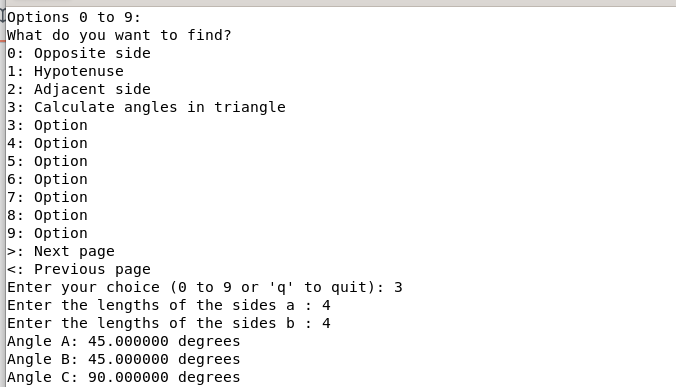
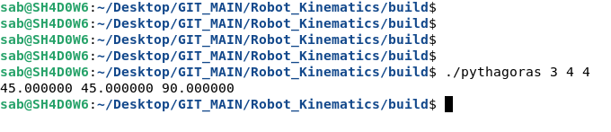

# Robot_Kinematics


**`Simple Input Method :`**

<p align="center">
  
</p>


**`Advanced Input Method :`**

./pythagoras <input option> <1st_input_value> <2nd_input_value>

<p align="center">
  
</p>


### you need to link the math library explicitly by adding the -lm flag when compiling your program

gcc pythagoras.c -o pythagoras -lm


or

```
mkdir build
cd build/
cmake ..
make
```

or 

### lazy_programmer
### Why write code today when you can debug it tomorrow?

```
git clone "https://github.com/Tpj-root/Robot_Kinematics.git"
cd Robot_Kinematics
mkdir build && cd build && cmake .. && make
```


**Explanation:**

    Command-line Arguments:
        The program first checks if any command-line arguments (argc > 1) are passed.
        The first argument (argv[1]) is the choice (0, 1, or 2), and the next two arguments (argv[2] and argv[3]) are the input values (a, b, or h).
        If three arguments are provided (argc == 4), it calculates the result based on the choice.

**No Arguments:**

    If no command-line arguments are provided (argc == 1)

**Invalid Number of Arguments:**

    If the wrong number of arguments is given, it shows an error message with usage instructions.


```
./pythagoras 1 4 4 # 5.66
```


```
seq 1 10 | while read line; do ./pythagoras 1 $line $line; done
```

```
1.41
2.83
4.24
5.66
7.07
8.49
9.90
11.31
12.73
14.14
```

## Bash Script Example

Arrays: We define two arrays, array1 and array2, with the desired values.
Loop: The for loop iterates over the indices of array1 (you could also use array2 since they are of the same length).
Command: Inside the loop, it calls the pythagoras program, passing the specified values.

```
# Define your arrays
array1=(0 1 2 3 4 5)
array2=(5 4 3 2 1 0)

# Loop through the arrays and call your pythagoras program
for i in "${!array1[@]}"; do
    ./pythagoras 1 "${array1[$i]}" "${array2[$i]}"
done

```

###  single line command

```
for i in {0..5}; do ./pythagoras 1 $i $((5-i)); done
```

for i in {0..5}: This loops through the values from 0 to 5.


rotate_point.c
Cartesian coordinates (x,y)(x,y), rotates it by a specified angle (in degrees)


Function Definitions:

    degrees_to_radians(double degrees): Converts degrees to radians.
    rotate_point(double x, double y, double angle, double *new_x, double *new_y): Rotates the point by the specified angle using the rotation matrix.
    cartesian_to_polar(double x, double y, double *r, double *theta): Converts Cartesian coordinates to Polar coordinates.
    
    
Main Function:

    Prompts the user for Cartesian coordinates (x,y)(x,y) and the rotation angle.
    Calls the rotate_point function to compute the new coordinates.
    Calls the cartesian_to_polar function to convert the new Cartesian coordinates into Polar coordinates.
    Outputs the new Cartesian coordinates and their Polar representation.
    
    


###  How to add a new function to the code


First create the function


// calculate_triangle_angles_degrees
struct Angles {
    double angleA;
    double angleB;
    double angleC;
};

struct Angles calculate_triangle_angles(double a, double b) {
    struct Angles angles;
    
    angles.angleA = atan(b / a) * (180.0 / M_PI); // Angle opposite side a
    angles.angleB = atan(a / b) * (180.0 / M_PI); // Angle opposite side b
    angles.angleC = 90.0; // Right angle

    return angles;  // Return the struct
}


then edit your choice

```
printf("Enter your choice (0, 1, 2 or 3): ");
```


then add your case ??

```
            case 3:
                // Find adjacent side
                printf("Enter the lengths of the sides a : ");
                scanf("%lf", &a);
                printf("Enter the lengths of the sides b : ");
                scanf("%lf", &b);
                struct Angles angles = calculate_triangle_angles(a, b);
                printf("Angle A: %lf degrees\n", angles.angleA);
                printf("Angle B: %lf degrees\n", angles.angleB);
                printf("Angle C: %lf degrees\n", angles.angleC);
                break;
```

then, Command-line argument input handling


```
            case 3:
                // Find adjacent side
                angles = calculate_triangle_angles(a, b);
                printf("%lf %lf %lf \n", angles.angleA, angles.angleB, angles.angleC);
                break;

```


